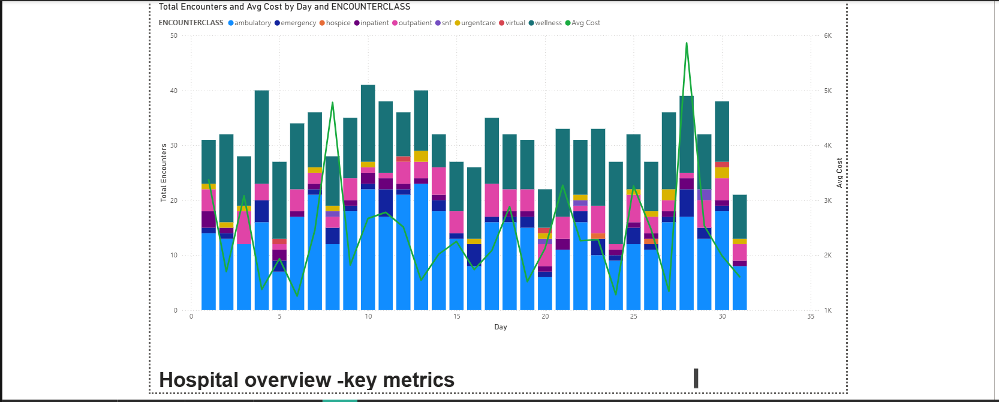
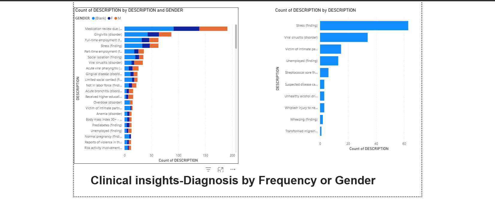
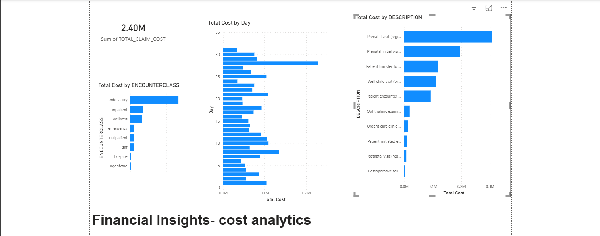

# Synthea Healthcare Data Analysis

## Overview
This project analyzes synthetic electronic health record (EHR) data from Synthea (1,000+ patients, 10,000+ encounters) to uncover insights into patient demographics, clinical conditions, and operational metrics. The goal is to demonstrate data extraction, transformation, and visualization skills using SQL and Power BI.

## Tools Used
- **SQL (MySQL)** – data extraction, cleaning, and analysis
- **Power BI** – data modeling, DAX measures, interactive dashboards

## Key Insights
- **14% overall readmission rate**, with patients 65+ having twice the rate (20%).
- Cardiology had the highest cost impact at ₹21 lakh.
- Emergency encounters account for 30% of all visits but 45% of total costs.
- Top 3 diagnoses: Hypertension, Diabetes, Acute bronchitis.

## Dashboard Pages
### Page 1: Hospital Overview

### Page 2: Clinical Insights

### Page 3: Financial Insights

## SQL Queries
Key queries used in analysis:
- [Total patients](sql_scripts/total_patients.sql)
- [Average length of stay](sql_scripts/avg_length_of_stay.sql)
- [Top 10 diagnoses](sql_scripts/top_10_diagnoses.sql)
- [Patients not seen in over a year](sql_scripts/patients_not_seen.sql)
- [ROW_NUMBER to sequence encounters](sql_scripts/row_number_encounters.sql)

## Contact
**Shreyas Victoria B**  
📧 victoriabhaskar07@gmail.com  
🔗 [LinkedIn](https://www.linkedin.com/in/shreya-victoria-6bb8511b9/)
